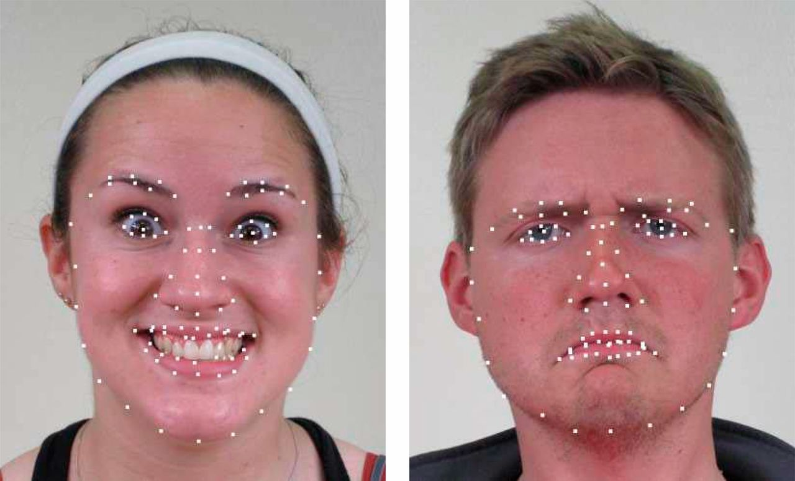
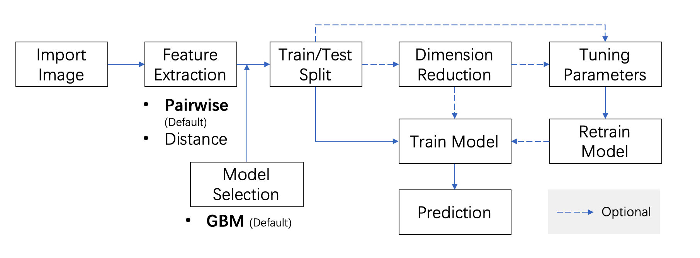
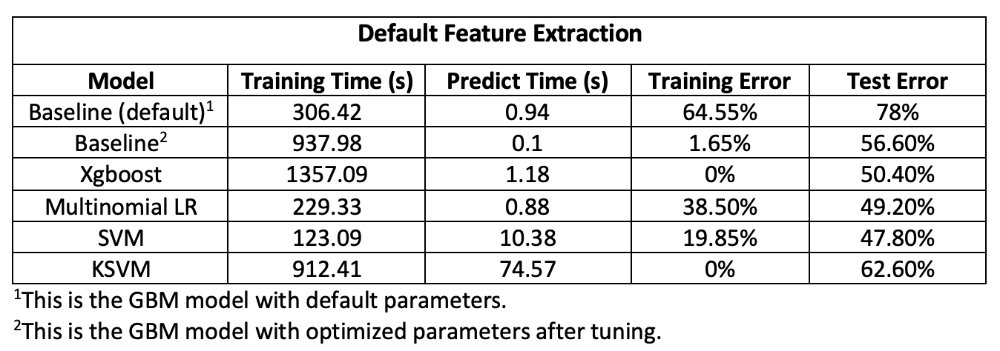

# Project: Can you recognize the emotion from an image of a face? 

(Image source: https://www.pnas.org/content/111/15/E1454)

### [Full Project Description](doc/project3_desc.md)

Term: Spring 2020

+ Team 11
+ Team members
	+ Guo, Junyan
	+ Chen, Shuxin 
	+ Shang, Haoyu
	+ Bian, Xinyi
	+ Shi, Mengying

+ Project summary: In this project, we created a classification engine for facial emotion recognition. The baseline model we were given at the very begining was boosted decision stumps (i.e. GBM). Our goal is to reduce the computation time and error rate in classifying facial emotions by improving feature extractions or building better models. 
  + This graph indicated our process of working in this project.
  
  
  + It turned out that the default feature extraction method which was given in the starter code performed best. We tried to apply PCA on features extracted but it increased the error rate a lot. 
  + Models attempted to construct in this project include Decision Tree, RandomForest, GBM, Xgboost, Adaboost, Multinomial Logistic Regression, Support Vector Machine(SVM), KSVM. Models gave relative good predictions were listed in the following results. 
  

+ Results 
  

  + According to this result table, we can find that the performance of baseline model improved after tuning its parameters but it did take long time (about 30 hours) for tuning. The prediction of xgboost model is fine but its traning time is the longest. It is great to see that SVM model with linear kernel trained the model fastest and gave the best performance. 
  

	
**Contribution statement**: ([default](doc/a_note_on_contributions.md)) All team members contributed to this project. All team members approve our work presented in this GitHub repository including this contributions statement.
+ Guo, Junyan: He is the group leader. He was in charge of writing main.rmd document and function related R ducuments such as test.R, train.R, tune.R and cross_validation.R. He conducted the baseline model(including tuning), xgboost model and adaboost model. He also took part in feature extraction. 

+ Chen, Shuxin: She built models of multinomial logistic regression, SVM and RandomForest and tuned parameters in these models. She was in charge of writing README.md file and also joined feature extraction part. 

+ Shang, Haoyu: He built KSVM and SVM model. He performed HGO feature extraction on facial image and KPCA on default extraction dataset to attempt to achieve project goal. 

+ Bian, Xinyi: She prepared slides for presentation and she was the presenter of our group.  

+ Shi, Mengying: She constructed binomial logistic model and default SVM model. 


Following [suggestions](http://nicercode.github.io/blog/2013-04-05-projects/) by [RICH FITZJOHN](http://nicercode.github.io/about/#Team) (@richfitz). This folder is orgarnized as follows.

```
proj/
├── lib/
├── data/
├── doc/
├── figs/
└── output/
```

Please see each subfolder for a README file.
